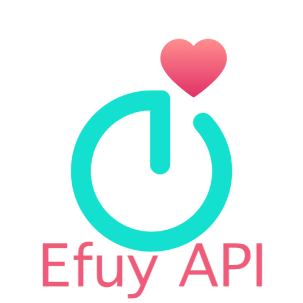

<p align="center">
  
</p>

<h1 align="center">EufyLife API Integration for Home Assistant</h1>

[![GitHub Release][releases-shield]][releases]
[![License][license-shield]](LICENSE)
[![hacs][hacsbadge]][hacs]
[![Project Maintenance][maintenance-shield]][user_profile]
[![BuyMeCoffee][buymecoffeebadge]][buymecoffee]
[![Community Forum][forum-shield]][forum]

**This integration will set up the following platforms:**

| Platform | Description |
| -------- | ----------- |
| `sensor` | Show current weight, target weight, body fat, muscle mass, and BMI for each family member |
| `light` | Discover and control Eufy lights (Outdoor Pathway T8L30, Indoor Floor Lamp T8L40, Permanent Outdoor Lights E22, and any other light in the account's Eufy light cloud) |
| `select` | **Scene** — the lights' catalog presets and the account's own scenes, applied by name — and **Effect Direction** per light |
| `number` | **Effect Speed** per light |

## Features

- 🔐 **Easy Setup**: Email/password authentication through Home Assistant UI
- ⚖️ **Weight Tracking**: Current weight and target weight sensors
- 📊 **Body Composition**: Body fat percentage, muscle mass, and BMI
- 👥 **Multi-User**: Supports multiple family members on the same scale
- 🔄 **Real-time Updates**: Automatic data synchronization with configurable intervals (1 min to 12 hours)
- ⚙️ **Configurable**: Adjust update frequency after setup without restarting Home Assistante
- 💡 **Eufy Lights**: On/off, brightness, native RGBWW picker (including warm/cool white LEDs), classic presets and segmented control for the Eufy lights in your account. Verified against the E10 series (Outdoor Pathway T8L30 and Indoor Floor Lamp T8L40); newer models such as the E22 permanent outdoor lights are discovered automatically and driven through the generic light protocol
- 🎨 **Scenes as a control**: the shared catalog plus the scenes of the account's own `Persoonlijk` tab as a `scene` select per light, and the running effect with its cloud id, mode, source, speed and direction readable from the light's attributes

## Installation

### HACS (Recommended)

EufyLife API is not in the HACS default list yet, so add this repository to HACS
as a custom repository first:

1. Have [HACS](https://hacs.xyz/) installed
2. In the HACS panel, go to "Integrations"
3. Click the three-dot menu (⋮) in the top right and choose **Custom repositories**
4. Paste `https://github.com/zer0-t/eufylife-api-hacs`, pick **Integration** as the category and click **Add**
5. Back in "Integrations", click the "+ EXPLORE & DOWNLOAD REPOSITORIES" button
6. Search for "EufyLife API" and download it
7. Restart Home Assistant
8. In the HA UI go to "Configuration" -> "Integrations" click "+" and search for "EufyLife API", then enter your EufyLife email, password and country there (see [Configuration](#configuration))

The integration ships its own icon and logo (`custom_components/eufylife_api/brand/`), which
Home Assistant 2026.3 and later show beside it. HACS still draws the icon of a custom
repository from the brands CDN, which no longer lists custom integrations, so its card shows
"logo not available" until HACS serves a repository's own brand images
([hacs/integration#5388](https://github.com/hacs/integration/pull/5388)) - that has no effect on
the integration itself.

### Manual Installation

1. Using the tool of choice open the directory (folder) for your HA configuration (where you find `configuration.yaml`)
2. If you do not have a `custom_components` directory (folder) there, you need to create it
3. In the `custom_components` directory (folder) create a new folder called `eufylife_api`
4. Download _all_ the files from the `custom_components/eufylife_api/` directory (folder) in this repository
5. Place the files you downloaded in the new directory (folder) you created
6. Restart Home Assistant
7. In the HA UI go to "Configuration" -> "Integrations" click "+" and search for "EufyLife API"

## Configuration

Configuration is done through the Home Assistant UI:

1. Go to **Configuration** → **Integrations**
2. Click **Add Integration** and search for "EufyLife API"
3. Enter your EufyLife account credentials:
   - **Email**: Your EufyLife account email
   - **Password**: Your EufyLife account password
4. Choose your preferred update interval (default: 5 minutes)
5. The integration will automatically discover your devices and family members
6. Scale sensors and light entities will be created for the devices the account exposes

Use the same direct email/password login that works in the Eufy Life app. Accounts
created with Google or Apple sign-in may need a Eufy password set or reset first.

Your credentials are stored in the Home Assistant config entry
(`.storage/core.config_entries`) and are only used to obtain and refresh the EufyLife API
tokens. They are never part of this repository - the HACS download and the source code
contain no secrets - and the same dialog is used again if the password changes (reauth).

### Update Intervals

You can configure how often the integration fetches new data:

- **1 minute**: For frequent weighing sessions
- **2 minutes**: For regular daily use
- **5 minutes**: Recommended default
- **10, 15, 30 minutes**: For moderate usage
- **1, 2, 6, 12 hours**: For occasional use

To change the update interval after setup:
1. Go to **Configuration** → **Integrations**
2. Find "EufyLife API" and click on it
3. Click the **Options** button
4. Select your desired update interval
5. Click **Submit**

## Supported Devices

- EufyLife smart scales connected to the EufyLife mobile app
- Eufy lights in the account's Eufy light cloud, including:
  - Outdoor Pathway Lights (`T8L30`) and Indoor Floor Lamp (`T8L40`) of the E10 series (verified end to end)
  - Permanent Outdoor Lights E22 (`T8L02`): driven through the family's animation protocol, state read verified on real hardware
- Shared accounts: lights shared with your account are discovered too

The family shares one wire protocol. Your light reports its code in the `model`
attribute and the retail name in `model_name`:

| Code | Product | Status |
| ---- | ------- | ------ |
| `T8L00` | Permanent Outdoor Light E120 (30 m) | code known, not captured |
| `T8L01` | Permanent Outdoor Light E120 (15 m) | code known, not captured |
| `T8L02` | Permanent Outdoor Lights E22 | verified end to end (state read, 50 segments) |
| `T8L04` | Permanent Outdoor Lights S4 | code known, not captured |
| `T8L10` | Outdoor String Lights E10 | code known, not captured |
| `T8L20` | Outdoor Spotlights E10 | code known, not captured |
| `T8L30` | Outdoor Pathway Lights E10 | verified end to end |
| `T8L40` | Indoor Floor Lamp E10 | verified end to end |

### Validation

If you have a light that is not being discovered, you can run a validation script to see which devices are linked to your account:

1. Install dependencies: `pip install aiohttp cryptography paho-mqtt`
   (paho-mqtt 1.6.1 and 2.x are both supported)
2. Run the script: `python3 scripts/validate_lights.py`
3. Enter your EufyLife credentials when prompted.

The script will list all lights found in your account along with their model IDs,
and provides an interactive menu to test power, brightness, colors and effects.
Use the `d` option in the control menu for a report of the effects catalog: every
entry with the command the integration sends for it (`0x020D` layered animation
frame, `0x0206` dynamic effect or `0x0210` classic params), plus the full JSON of
the entries the parser skips — which is what a scene the app offers but Home
Assistant does not looks like. `j` dumps the untouched catalog JSON, `p` prints the
cached state the integration feeds to Home Assistant (power, brightness, the
reported mode/light id, the effect name with its catalog entry, colors, speed and
direction), and `--list-animations` prints the same per-preset tags without an
interactive session.

Scenes you build in the app itself — its `Persoonlijk` tab — are account data
rather than catalog entries: the phone keeps them in the light cloud under
`/app/light/diy/list`, and while one runs the light reports a mode id it was built
from in `A4` plus the scene's own cloud id in `A6` (`kerst` and `disco 1` were
captured as 20002/171200 and 30011/168622). Discovery reads that list for every
light, so those scenes are part of the effect list by name:

```bash
python3 scripts/validate_lights.py --country NL --personal-scenes
python3 scripts/validate_lights.py --country NL --watch-app 90
```

`--personal-scenes` (menu `c`) prints what that call returned for the selected
light — every scene by name with the cloud id it is applied with, the mode id the
light renders it as, its type, speed and palette — marks the ones that are account
data rather than catalog names, and cross-checks those ids against the ones
captured from a real light, so a scene the app shows but Home Assistant lacks is
visible per scene. Applying one writes a `0x0206` dynamic effect with the scene's
palette and its cloud id in `0xAC`, which is where the light reads the id it
reports back. `s` writes a scene id with the plain `0x0202` scene command, but
those lights acknowledge a scene write without changing what they render
(`E10_Animation_Research.md`), so `--watch-app SECONDS` (menu `w`) stays the way to
see the frame the app itself sends.

Because the integration subscribes to the device's request topic as well, frames
the Eufy app itself publishes are decoded and logged as `Eufy app frame for
<serial>: opcode=…, payload=…`. The app writes the same MQTT client id as the
integration (`android-eufy_life-<user id>`), so its traffic is told apart from the
broker's echo of the integration's own commands by the payload that went out —
keying off that client id would drop the app's frames as ours. The app's own
polling stays at debug level, so the frame a capture is after is not buried in it.
Setting a scene in the app while the script runs therefore prints the exact frame
the app writes, which is the reference for teaching the integration that scene —
unless the app reaches the light over the local network, in which case only the
light's own report of the new state is seen. `--watch-app SECONDS` (menu `w`) is
that capture as one guided command: it prints each frame the phone publishes as
`>> APP …` and each light frame as `>> LIGHT …`, raises the log level for its
duration so the watched lines cannot be filtered away, and ends with how many of
each arrived, the state the light now reports and a verdict — a watch without a
single `>> APP` line means that tap went over BLE, WLAN or the cloud rather than
MQTT. Press `r` and then `p` at any time to see the same state with its catalog
entry.

To see exactly what the cloud returns, including entries the integration cannot
turn into entities, run the discovery report instead:

```bash
python3 scripts/discover_lights.py --country NL
```

It prints the raw device-relation response, the model code and retail name of every
entry, and a summary per discovered light (protocol path, handshake trait, power,
brightness, the active effect, segment count and preset count). Report the model codes that are listed
as unverified so their protocol can be validated and added to the verified list.

It also prints whether the MQTT link was accepted, how many messages arrived and
which topics they came from. If a light shows `power=None` (the cloud inventory
answered but no status frame arrived), re-run with diagnostics:

```bash
python3 scripts/discover_lights.py --country NL --debug --wait 30
```

`--debug` prints the raw MQTT traffic and the integration's log output, `--wait`
listens longer for a slow device and `--handshake` sends the 0200 session
handshake before waiting. To see what the phone app itself sends for such a
light, run `python3 scripts/sniff_eufy_mqtt.py` and operate the light in the
Eufy Life app; every frame it exchanges is appended to `mqtt_sniff.log`.

Before digging into the protocol, check that the light has power. A light that is
switched off at the mains is still listed by the cloud with its last known state
but answers nothing, and its `device_status` in the cloud inventory reads `0` where
a reachable light reports `1`; the discovery report prints that value next to a
silent light. The integration also ignores the broker's echo of its own commands,
so a `messages=1` line that only mentions `…/req` means the light has not answered.

### Light controls

Open the light's more-info panel for brightness, the native RGBWW picker (supporting
R, G, B, Warm White, and Cold White LEDs) and the effect selector. Classic presets
are discovered from the account's Eufy catalog; the tested E10 exposes White, Warm
White, Cool White, Welcome1, Alarm1 and Alexa1. Every catalog entry the integration
can serialize becomes an option of that selector, so the whole catalog is
switchable from Home Assistant: the E22 exposes all 89 presets of its account
(dynamic, seasonal and holiday scenes) and the selector follows the scene the light
reports running. Existing `light.turn_on`/`light.turn_off` automations keep working.

Models that have not been verified yet are still discovered. Their entities expose
`protocol: generic` in the attributes and use the classic E10 command path (power,
brightness, RGBWW and cloud presets). Lights whose model has been verified against
real hardware and that render the family's binary animation frame expose
`protocol: modern`: the Indoor Floor Lamp (`T8L40`, captured here) and the Permanent
Outdoor Lights E22 (`T8L02`, state read captured here, binary animation layer
cross-checked against the sibling
[eufy-sdk](https://github.com/mega-yfue/eufy-sdk) project). A live E22 answers the
classic settings request with power, brightness and its 50-segment count and needs
no session handshake; the light sends that reply on the iOS-style
`cmd/…/app/res` topic, which the integration subscribes to.

The same list of presets and personal scenes is a select of its own,
**Scene** (`select.<device>_scene`), with one option per scene from the account's
catalog and its `Persoonlijk` tab. Choosing one applies it and switches the light
on, because a scene on a light that is switched off is invisible — the same result
as tapping a scene in the app. That makes scenes addressable by name from an
automation (`select.select_option`) instead of through the light's effect
attribute.

```yaml
action: light.turn_on
target:
  entity_id: light.eufy_e10_light
data:
  brightness_pct: 50
  rgbww_color: [255, 128, 0, 255, 0]
```

Replace `rgbww_color` with `effect: Warm White` to select a preset. Select a color
or a preset, not both. Brightness is retained unless supplied in the action.
Power and brightness come from device reports, and so does the active effect: the
light reports the cloud id of the preset it is running and that id is matched
against the account's catalog. A colour you set is remembered only after a
successful device ACK and is marked assumed in HA. The per-segment palette still
cannot be read back — a light that runs a preset reports no colour data at all —
so colours selected in the app are not reconstructed after restarting HA or after a
mode change that does not come from HA.

The light's own report is readable from its attributes, so an automation can see
what is actually running rather than what was asked for:

| Attribute | Meaning |
| --- | --- |
| `effect_id` | The cloud id the light named for the effect it runs — a catalog preset's own id, or the id of one of your scenes |
| `light_id` | The mode the light reports rendering (`A4` of its report; `20002` for a running scene, `20006` for a plain colour) |
| `effect_source` | Whether the running effect's name came from your account's own scenes (`app`) or from the shared catalog (`catalog`); absent when the running effect has no name |
| `speed`, `direction` | The values the effect was applied with: what you wrote through the effect speed number or the effect direction select, and otherwise the values the effect itself carries — a report never echoes them |
| `palette` | The colours of the last palette the light acknowledged, one per lamp, deduplicated |
| `last_report` | UTC timestamp of the report the light last sent (or answered) |
| `online` | The reachability the cloud lists for the light |

```yaml
trigger:
  - platform: state
    entity_id: light.eufy_e22_permanent_outdoor_lights
    attribute: effect_id
action:
  - action: persistent_notification.create
    data:
      title: The lights changed scene
      message: >-
        They now run effect {{ state_attr(trigger.entity_id, 'effect_id') }}
        at {{ state_attr(trigger.entity_id, 'speed') }}.
```

A report whose cloud id is not in the account's own list leaves `effect_id` as the
id the light showed and no effect name at all, rather than the name of whatever ran
before it: two personal scenes can share the mode a report carries, so the previous
name would name the wrong scene.

### Advanced Controls (Segmented DIY Mode)

For more advanced control, such as setting different colors for each lamp segment,
adjusting animation speed or direction, use the `eufylife_api.set_light_settings` service:

```yaml
action: eufylife_api.set_light_settings
target:
  entity_id: light.eufy_e10_light
data:
  colors:
    - [255, 0, 0]      # Segment 1: Red
    - [0, 255, 0]      # Segment 2: Green
    - [0, 0, 255]      # Segment 3: Blue
    - [255, 255, 0, 255, 0] # Segment 4: Yellow + Warm White
  speed: 5             # 1 (slow) to 10 (fast)
  direction: 1         # 0 or 1
```

The `colors` list must have exactly as many entries as there are segments in your
light (check the `lamp_count` attribute of the entity). Each entry can be a
3-tuple `[R, G, B]` or a 5-tuple `[R, G, B, W, C]`, and repeated colours are
collapsed into a single addressed block. Because one frame carries the whole
palette — a single-byte length prefix caps it at 50 distinct colours, so 50
addressed segments — per-segment entities are only created for lights with up to
`MAX_SEGMENT_ENTITIES` (32) segments; longer strips stay on their main light entity
(one colour for the whole strip always fits).

### Scenes and the AI

The `Persoonlijk` tab of the Eufy app is account data rather than a catalog the
cloud serves every account, and the integration reads the same route the app does
(`/app/light/diy/list`), so those scenes are already selectable by name in the
light's effect list and in its **Scene** select, which applies the chosen scene
and switches the light on so that the scene is visible. They can also be created,
changed and removed from Home Assistant, which is what these services are for:

| Service | What it does |
| --- | --- |
| `eufylife_api.create_scene` | Saves a scene to your account. It appears in the app's `Persoonlijk` tab and as an effect by name. Fields: `name`, `colors` (3- or 5-tuples; a few colours are repeated along the strip, one per segment builds it segment by segment; empty saves what the light shows now), `mode`, `brightness`, `speed`, `direction`, `context` |
| `eufylife_api.create_ai_scene` | Asks Eufy's AI for a light effect and saves it: `name` plus `prompt` (leave `prompt` out to let the AI pick at random, which is the app's magic dice) |
| `eufylife_api.preview_ai_effect` | Generates with the AI and shows the result on the light without saving it: `prompt`. The design's own speed, direction and brightness go to the light as well, so the lamp shows the design even when it was left dim or off |
| `eufylife_api.delete_scene` | Removes a scene of your account by `effect` name or by `light_id`. Catalog presets are shared by every account and cannot be deleted |

```yaml
action: eufylife_api.create_ai_scene
target:
  entity_id: light.eufy_e22_lights
data:
  name: "Winteravond"
  prompt: "a quiet snowy evening with warm candle light"
```

The AI answers a design — a description it writes itself (`context`), a palette, a
mode, a brightness and a speed — and that design is what gets saved. Two calls with
the same description do not answer the same design, so it is an idea rather than a
lookup, and each save costs one generation. Saving re-reads the light's effect list,
so the scene is selectable by name immediately; deleting clears the selection if the
scene that vanished was the one running.

Showing a design is one step more than saving it: the palette frame carries only the
effect layer's own level, so a light that was left dim or off shows nothing of the
design until its brightness is applied too. `preview_ai_effect` therefore sends the
design's speed and direction with the palette and then turns the light on at the
design's brightness — the order the light entity itself uses. The service also retries
a generation the cloud fails on its own side (its response code `190002` was seen for
a description that answered fine a moment later); every attempt is a new generation,
because the same description does not answer the same design twice.

There is also a local browser studio for building scenes, in `scripts/`:

```bash
pip install -r scripts/requirements-dev.txt
python scripts/scene_studio.py     # then open http://127.0.0.1:8765
```

It shows a segment grid you paint, the palette and mode pickers, the AI tab with the
suggestion chips, the saved scenes with their cloud ids, and it saves through the
same client the services use. It also shows what the light itself reports — power,
brightness, effect id, speed, direction and the colours of its segments — and reads
that back from the light every minute, so a page left open follows the lamp instead of
the last thing the page wrote. That read is `/api/state?fresh=1`: it publishes a
settings request (the same one the integration makes after a write) and answers with
the lights that reported back, each one's own values; a light that stays silent leaves
the last report standing and the page says so. It is a development tool: the component
itself must not depend on Flask, so that dependency lives in
`scripts/requirements-dev.txt`. `python scripts/check_scene_studio.py` exercises its
web layer against a stub client, so every route's contract is checked without a cloud
account (and without a network).

## Sensors

For each family member, the integration creates the following sensors:

- **Weight** (`sensor.{name}_weight`) - Current weight in kg
- **Target Weight** (`sensor.{name}_target_weight`) - Weight goal in kg
- **Body Fat** (`sensor.{name}_body_fat`) - Body fat percentage
- **Muscle Mass** (`sensor.{name}_muscle_mass`) - Muscle mass in kg
- **BMI** (`sensor.{name}_bmi`) - Body Mass Index

### Device Information

Each family member appears as a separate device in Home Assistant with:
- Device name: "EufyLife Customer [ID]"
- Manufacturer: EufyLife
- Model: Smart Scale
- Last update timestamp and interval information

## API Details

This integration uses the official EufyLife API endpoints:

- **Authentication**: `POST /v1/user/v2/email/login`
- **Weight Data**: `GET /v1/customer/all_target`
- **Detailed Data**: `GET /v1/customer/target/{customer_id}`
- **Eufy light discovery**: encrypted Eufy Life AIoT device-list API
- **Eufy light state/control**: certificate-authenticated Eufy Life MQTT


## Limitations

- Requires active internet connection for cloud API access
- Newer-format animated/AI presets are limited to the catalog entries whose layer params the integration can serialize; unsupported entries are hidden from the effect list. Scenes you build yourself in the app (the `Persoonlijk` tab) are not catalog entries: they are read from the account's own scene list (`/app/light/diy/list`) and offered by name as dynamic effects, so `--personal-scenes` is the report to run when one of them does not show up — it prints every scene with the ids and palette behind its name
- Unverified light models (any code not in the table above) are controlled through the generic light protocol; some model-specific features may need a follow-up protocol verification
- Lights that only exist in the eufy Security app are not part of the Eufy Life light cloud (a different cloud and transport) and cannot be controlled by this integration
- data are avaialbe after open the app in your phone
- Token expires after 30 days (automatic re-authentication planned for future versions)
- Historical data is limited to what's available via the current API endpoints

## Contributions are welcome!

If you want to contribute to this please read the [Contribution guidelines](.github/CONTRIBUTING.md)


## Disclaimer

This is an unofficial integration. EufyLife and Eufy are trademarks of Anker Innovations Limited.

---

[integration_blueprint]: https://github.com/ludeeus/integration_blueprint
[buymecoffee]: https://buymeacoffee.com/mshary
[buymecoffeebadge]: https://img.shields.io/badge/buy%20me%20a%20coffee-donate-yellow.svg?style=for-the-badge
[hacs]: https://github.com/hacs/integration
[hacsbadge]: https://img.shields.io/badge/HACS-Custom-orange.svg?style=for-the-badge
[exampleimg]: .github/logo.png
[forum-shield]: https://img.shields.io/badge/community-forum-brightgreen.svg?style=for-the-badge
[forum]: https://community.home-assistant.io/
[license-shield]: https://img.shields.io/github/license/zer0-t/eufylife-api-hacs.svg?style=for-the-badge
[maintenance-shield]: https://img.shields.io/badge/maintainer-%40zer0--t-blue.svg?style=for-the-badge
[releases-shield]: https://img.shields.io/github/release/zer0-t/eufylife-api-hacs.svg?style=for-the-badge
[releases]: https://github.com/zer0-t/eufylife-api-hacs/releases
[user_profile]: https://github.com/zer0-t
